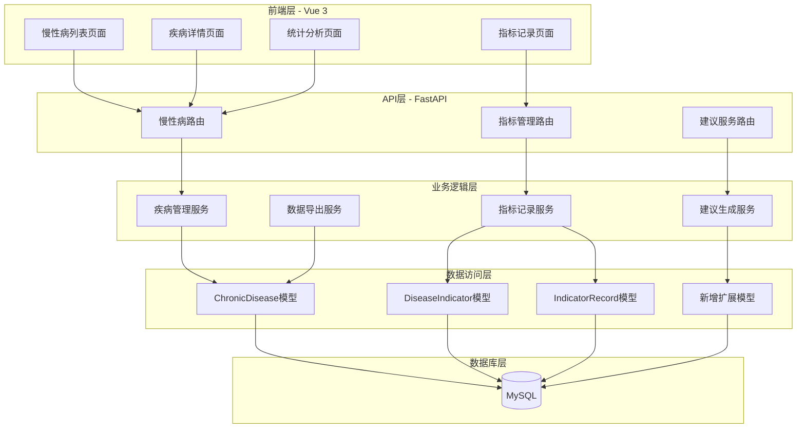
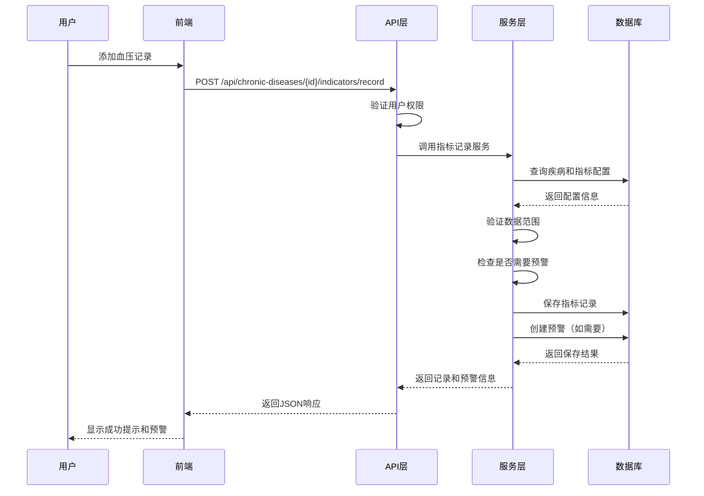
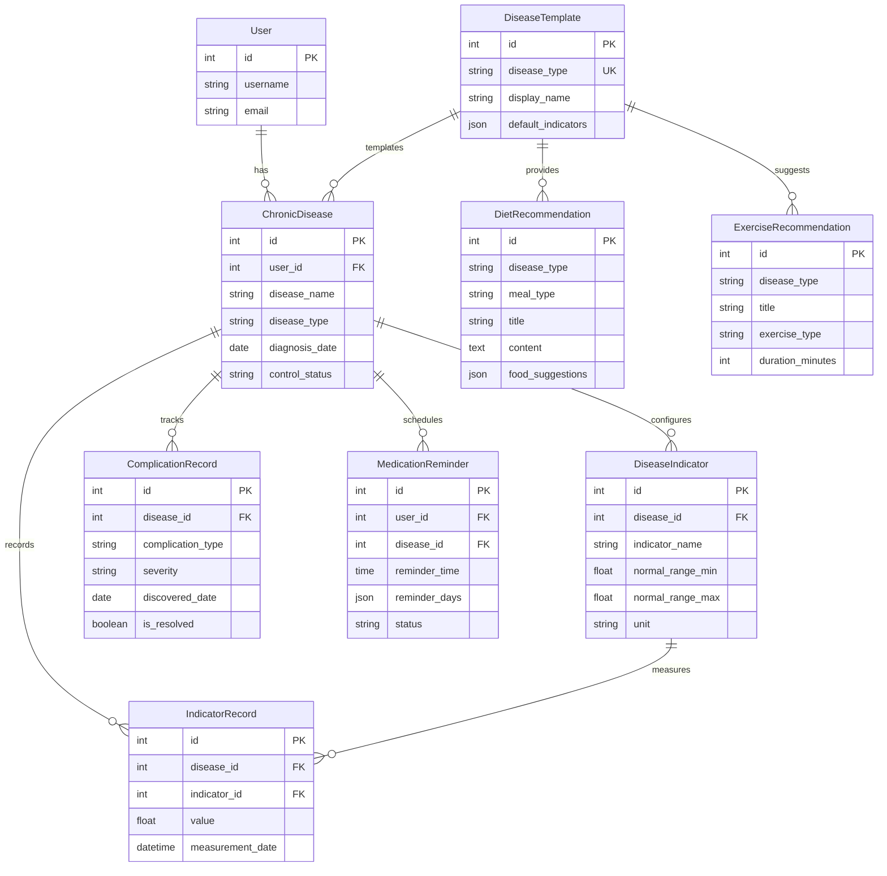

# 设计文档：慢性病管理模块

## 概述

慢性病管理模块是药药记医疗管理系统的核心功能扩展，旨在为三种常见慢性病（高血压、高血脂、糖尿病）提供专业化的健康数据管理和个性化建议服务。本设计基于现有的 ChronicDisease、DiseaseIndicator 和 IndicatorRecord 数据模型，通过扩展和优化来实现针对性的疾病管理功能。

### 设计目标

1. 利用现有的慢性病管理基础架构，避免重复开发
2. 为三种预设慢性病类型提供专业化的数据记录和管理功能
3. 实现灵活的指标配置系统，支持不同疾病的特定健康指标
4. 提供个性化的健康建议和饮食推荐
5. 确保数据安全和用户隐私保护
6. 提供良好的用户体验和响应式界面

### 技术栈

- 后端：Python 3.13 + FastAPI + SQLAlchemy
- 前端：Vue 3 + TypeScript + Element Plus
- 数据库：MySQL 8.0
- 部署：Kubernetes + Docker

## 架构设计

### 系统架构

系统采用前后端分离的三层架构：



### 数据流设计



## 组件和接口设计

### 数据模型扩展

基于现有模型，我们需要添加以下扩展表：

#### 1. 疾病类型模板表（disease_templates）

用于存储三种预设疾病的配置模板：

```python
class DiseaseTemplate(Base):
    """疾病类型模板表"""
    __tablename__ = "disease_templates"
    
    id = Column(Integer, primary_key=True, index=True)
    disease_type = Column(String(50), unique=True, nullable=False)  # hypertension/hyperlipidemia/diabetes
    display_name = Column(String(100), nullable=False)  # 显示名称
    icd10_code = Column(String(20), nullable=True)  # 默认ICD-10编码
    description = Column(Text, nullable=True)  # 疾病描述
    
    # 预设指标配置（JSON格式）
    default_indicators = Column(JSON, nullable=False)
    # 示例: [
    #   {"name": "收缩压", "unit": "mmHg", "normal_min": 90, "normal_max": 140},
    #   {"name": "舒张压", "unit": "mmHg", "normal_min": 60, "normal_max": 90}
    # ]
    
    created_at = Column(DateTime, default=datetime.now)
```

#### 2. 饮食建议表（diet_recommendations）

存储针对不同疾病的饮食建议：

```python
class MealType(str, enum.Enum):
    """餐次类型"""
    BREAKFAST = "breakfast"
    LUNCH = "lunch"
    DINNER = "dinner"
    SNACK = "snack"

class DietRecommendation(Base):
    """饮食建议表"""
    __tablename__ = "diet_recommendations"
    
    id = Column(Integer, primary_key=True, index=True)
    disease_type = Column(String(50), nullable=False)  # 疾病类型
    meal_type = Column(Enum(MealType), nullable=True)  # 餐次（糖尿病专用）
    
    title = Column(String(200), nullable=False)  # 建议标题
    content = Column(Text, nullable=False)  # 建议内容
    food_suggestions = Column(JSON, nullable=True)  # 推荐食物列表
    food_restrictions = Column(JSON, nullable=True)  # 禁忌食物列表
    
    # 适用条件（JSON格式）
    applicable_conditions = Column(JSON, nullable=True)
    # 示例: {"blood_sugar_level": "high", "control_status": "poor"}
    
    priority = Column(Integer, default=0)  # 优先级
    is_active = Column(Boolean, default=True)
    
    created_at = Column(DateTime, default=datetime.now)
    updated_at = Column(DateTime, default=datetime.now, onupdate=datetime.now)
```

#### 3. 并发症记录表（complication_records）

专门用于糖尿病并发症追踪：

```python
class ComplicationSeverity(str, enum.Enum):
    """并发症严重程度"""
    MILD = "mild"
    MODERATE = "moderate"
    SEVERE = "severe"

class ComplicationRecord(Base):
    """并发症记录表"""
    __tablename__ = "complication_records"
    
    id = Column(Integer, primary_key=True, index=True)
    disease_id = Column(Integer, ForeignKey("chronic_diseases.id"), nullable=False)
    
    complication_type = Column(String(100), nullable=False)  # 并发症类型
    severity = Column(Enum(ComplicationSeverity), nullable=False)  # 严重程度
    discovered_date = Column(Date, nullable=False)  # 发现日期
    symptoms = Column(Text, nullable=True)  # 症状描述
    treatment = Column(Text, nullable=True)  # 治疗方案
    
    # 追踪信息
    is_resolved = Column(Boolean, default=False)  # 是否已解决
    resolved_date = Column(Date, nullable=True)  # 解决日期
    notes = Column(Text, nullable=True)  # 备注
    
    created_at = Column(DateTime, default=datetime.now)
    updated_at = Column(DateTime, default=datetime.now, onupdate=datetime.now)
    
    # 关系
    disease = relationship("ChronicDisease", foreign_keys=[disease_id])
```

#### 4. 运动建议表（exercise_recommendations）

存储针对糖尿病的运动建议：

```python
class ExerciseRecommendation(Base):
    """运动建议表"""
    __tablename__ = "exercise_recommendations"
    
    id = Column(Integer, primary_key=True, index=True)
    disease_type = Column(String(50), nullable=False)  # 疾病类型
    
    title = Column(String(200), nullable=False)  # 建议标题
    exercise_type = Column(String(100), nullable=False)  # 运动类型
    duration_minutes = Column(Integer, nullable=True)  # 建议时长（分钟）
    frequency_per_week = Column(Integer, nullable=True)  # 每周频率
    intensity = Column(String(50), nullable=True)  # 强度（low/moderate/high）
    
    description = Column(Text, nullable=False)  # 详细描述
    precautions = Column(Text, nullable=True)  # 注意事项
    
    # 适用条件
    applicable_conditions = Column(JSON, nullable=True)
    
    priority = Column(Integer, default=0)
    is_active = Column(Boolean, default=True)
    
    created_at = Column(DateTime, default=datetime.now)
```

#### 5. 用药提醒表（medication_reminders）

扩展现有的用药管理，添加提醒功能：

```python
class ReminderStatus(str, enum.Enum):
    """提醒状态"""
    ACTIVE = "active"
    PAUSED = "paused"
    COMPLETED = "completed"

class MedicationReminder(Base):
    """用药提醒表"""
    __tablename__ = "medication_reminders"
    
    id = Column(Integer, primary_key=True, index=True)
    user_id = Column(Integer, ForeignKey("users.id"), nullable=False)
    disease_id = Column(Integer, ForeignKey("chronic_diseases.id"), nullable=False)
    user_medication_id = Column(Integer, ForeignKey("user_medications.id"), nullable=False)
    
    reminder_time = Column(Time, nullable=False)  # 提醒时间
    reminder_days = Column(JSON, nullable=False)  # 提醒日期 [0-6]，0=周日
    
    status = Column(Enum(ReminderStatus), default=ReminderStatus.ACTIVE)
    
    # 提醒设置
    advance_minutes = Column(Integer, default=0)  # 提前提醒分钟数
    repeat_interval_minutes = Column(Integer, nullable=True)  # 重复提醒间隔
    
    created_at = Column(DateTime, default=datetime.now)
    updated_at = Column(DateTime, default=datetime.now, onupdate=datetime.now)
    
    # 关系
    user = relationship("User", foreign_keys=[user_id])
    disease = relationship("ChronicDisease", foreign_keys=[disease_id])
    medication = relationship("UserMedication", foreign_keys=[user_medication_id])
```

### API 接口设计

#### 慢性病管理接口

```python
# 1. 获取疾病类型模板列表
GET /api/disease-templates
Response: {
    "templates": [
        {
            "disease_type": "hypertension",
            "display_name": "高血压",
            "default_indicators": [...]
        }
    ]
}

# 2. 基于模板创建慢性病记录
POST /api/chronic-diseases/from-template
Request: {
    "disease_type": "hypertension",  # 或 hyperlipidemia, diabetes
    "diagnosis_date": "2024-01-15",
    "diagnosis_hospital": "北京协和医院",
    "custom_fields": {...}
}
Response: {
    "id": 1,
    "disease_name": "高血压",
    "indicators": [...]  # 自动创建的指标配置
}

# 3. 批量记录指标（支持多次测量）
POST /api/chronic-diseases/{disease_id}/indicators/batch-record
Request: {
    "records": [
        {
            "indicator_id": 1,
            "value": 135,
            "measurement_date": "2024-01-15T08:00:00",
            "notes": "早晨空腹"
        },
        {
            "indicator_id": 1,
            "value": 142,
            "measurement_date": "2024-01-15T14:00:00",
            "notes": "午餐后2小时"
        }
    ]
}
Response: {
    "saved_records": [...],
    "alerts": [...]  # 如果有异常
}
```

#### 饮食建议接口

```python
# 1. 获取饮食建议
GET /api/diet-recommendations
Query Parameters:
    - disease_type: string (hypertension/hyperlipidemia/diabetes)
    - meal_type: string (breakfast/lunch/dinner) [可选]
    - user_id: int [用于个性化]
Response: {
    "recommendations": [
        {
            "id": 1,
            "title": "糖尿病早餐建议",
            "meal_type": "breakfast",
            "content": "...",
            "food_suggestions": ["燕麦", "鸡蛋", "牛奶"],
            "food_restrictions": ["油条", "甜粥"]
        }
    ]
}

# 2. 获取个性化饮食建议
GET /api/chronic-diseases/{disease_id}/personalized-diet
Response: {
    "breakfast": {...},
    "lunch": {...},
    "dinner": {...},
    "general_tips": [...]
}
```

#### 并发症管理接口

```python
# 1. 记录并发症
POST /api/chronic-diseases/{disease_id}/complications
Request: {
    "complication_type": "糖尿病视网膜病变",
    "severity": "mild",
    "discovered_date": "2024-01-15",
    "symptoms": "视力轻微模糊",
    "treatment": "定期检查"
}

# 2. 获取并发症列表
GET /api/chronic-diseases/{disease_id}/complications
Response: {
    "complications": [
        {
            "id": 1,
            "complication_type": "糖尿病视网膜病变",
            "severity": "mild",
            "is_resolved": false,
            "discovered_date": "2024-01-15"
        }
    ]
}

# 3. 更新并发症状态
PUT /api/complications/{complication_id}
Request: {
    "severity": "moderate",
    "is_resolved": false,
    "notes": "病情有所发展"
}
```

#### 运动建议接口

```python
# 1. 获取运动建议
GET /api/exercise-recommendations
Query Parameters:
    - disease_type: string
    - user_id: int [用于个性化]
Response: {
    "recommendations": [
        {
            "id": 1,
            "title": "糖尿病有氧运动",
            "exercise_type": "快走",
            "duration_minutes": 30,
            "frequency_per_week": 5,
            "intensity": "moderate",
            "description": "...",
            "precautions": "..."
        }
    ]
}

# 2. 获取个性化运动建议
GET /api/chronic-diseases/{disease_id}/personalized-exercise
Response: {
    "recommended_exercises": [...],
    "current_blood_sugar_status": "...",
    "safety_tips": [...]
}
```

#### 用药提醒接口

```python
# 1. 创建用药提醒
POST /api/medication-reminders
Request: {
    "disease_id": 1,
    "user_medication_id": 1,
    "reminder_time": "08:00:00",
    "reminder_days": [1, 2, 3, 4, 5],  # 周一到周五
    "advance_minutes": 10
}

# 2. 获取用药提醒列表
GET /api/medication-reminders
Query Parameters:
    - disease_id: int [可选]
    - status: string [可选]
Response: {
    "reminders": [...]
}

# 3. 更新提醒状态
PUT /api/medication-reminders/{reminder_id}
Request: {
    "status": "paused"
}
```

#### 数据导出接口

```python
# 1. 导出慢性病数据
POST /api/chronic-diseases/export
Request: {
    "disease_ids": [1, 2],
    "format": "csv",  # 或 "pdf"
    "date_range": {
        "start": "2024-01-01",
        "end": "2024-01-31"
    },
    "include_indicators": true,
    "include_medications": true
}
Response: {
    "task_id": "export_123456",
    "status": "processing"
}

# 2. 检查导出状态
GET /api/export-tasks/{task_id}
Response: {
    "status": "completed",
    "download_url": "/api/downloads/export_123456.csv",
    "expires_at": "2024-01-16T00:00:00"
}

# 3. 下载导出文件
GET /api/downloads/{filename}
Response: File download
```

### 前端组件设计

#### 1. 慢性病列表组件（ChronicDiseaseList.vue）

```typescript
// 组件职责：
// - 显示用户的所有慢性病记录
// - 提供搜索和筛选功能
// - 显示空状态
// - 提供添加入口

interface ChronicDiseaseListProps {
  userId: number;
}

interface ChronicDiseaseListState {
  diseases: ChronicDisease[];
  loading: boolean;
  searchText: string;
  filterStatus: string;
  showCreateDialog: boolean;
}
```

#### 2. 疾病类型选择组件（DiseaseTypeSelector.vue）

```typescript
// 组件职责：
// - 显示三种预设疾病类型
// - 展示每种疾病的特点
// - 选择后自动配置指标

interface DiseaseTypeSelectorProps {
  modelValue: string;
}

interface DiseaseType {
  type: string;
  displayName: string;
  icon: string;
  description: string;
  features: string[];
}
```

#### 3. 指标记录组件（IndicatorRecordForm.vue）

```typescript
// 组件职责：
// - 根据疾病类型显示对应的指标输入表单
// - 支持多次测量（特别是血糖）
// - 实时验证和范围提示
// - 显示异常警告

interface IndicatorRecordFormProps {
  diseaseId: number;
  diseaseType: string;
  indicators: DiseaseIndicator[];
}

interface IndicatorRecordFormState {
  records: IndicatorRecordInput[];
  validationErrors: Record<string, string>;
  showWarnings: boolean;
}
```

#### 4. 饮食建议组件（DietRecommendations.vue）

```typescript
// 组件职责：
// - 显示个性化饮食建议
// - 糖尿病显示三餐建议
// - 高血脂显示通用饮食指导

interface DietRecommendationsProps {
  diseaseId: number;
  diseaseType: string;
}

interface DietRecommendation {
  mealType?: string;
  title: string;
  content: string;
  foodSuggestions: string[];
  foodRestrictions: string[];
}
```

#### 5. 并发症管理组件（ComplicationManager.vue）

```typescript
// 组件职责：
// - 记录和追踪并发症
// - 显示并发症时间线
// - 更新并发症状态

interface ComplicationManagerProps {
  diseaseId: number;
}

interface Complication {
  id: number;
  complicationType: string;
  severity: string;
  discoveredDate: string;
  isResolved: boolean;
  symptoms: string;
  treatment: string;
}
```

#### 6. 数据导出对话框（ExportDialog.vue）

```typescript
// 组件职责：
// - 选择导出格式
// - 选择导出内容
// - 选择日期范围
// - 显示导出进度

interface ExportDialogProps {
  visible: boolean;
  diseaseIds: number[];
}

interface ExportOptions {
  format: 'csv' | 'pdf';
  dateRange: {
    start: string;
    end: string;
  };
  includeIndicators: boolean;
  includeMedications: boolean;
  includeComplications: boolean;
}
```

## 数据模型

### 核心实体关系图



### 数据验证规则

#### 高血压指标验证

```python
HYPERTENSION_VALIDATION = {
    "收缩压": {
        "min": 60,
        "max": 250,
        "unit": "mmHg",
        "normal_range": (90, 140),
        "warning_threshold": 160,
        "critical_threshold": 180
    },
    "舒张压": {
        "min": 40,
        "max": 150,
        "unit": "mmHg",
        "normal_range": (60, 90),
        "warning_threshold": 100,
        "critical_threshold": 110
    }
}
```

#### 高血脂指标验证

```python
HYPERLIPIDEMIA_VALIDATION = {
    "总胆固醇": {
        "min": 0,
        "max": 15,
        "unit": "mmol/L",
        "normal_range": (0, 5.2),
        "warning_threshold": 6.2
    },
    "甘油三酯": {
        "min": 0,
        "max": 10,
        "unit": "mmol/L",
        "normal_range": (0, 1.7),
        "warning_threshold": 2.3
    },
    "高密度脂蛋白": {
        "min": 0,
        "max": 5,
        "unit": "mmol/L",
        "normal_range": (1.0, 999),  # 越高越好
        "warning_threshold": 0.9  # 低于此值警告
    },
    "低密度脂蛋白": {
        "min": 0,
        "max": 10,
        "unit": "mmol/L",
        "normal_range": (0, 3.4),
        "warning_threshold": 4.1
    }
}
```

#### 糖尿病指标验证

```python
DIABETES_VALIDATION = {
    "空腹血糖": {
        "min": 2.0,
        "max": 30.0,
        "unit": "mmol/L",
        "normal_range": (3.9, 6.1),
        "warning_threshold": 7.0,
        "critical_threshold": 11.1
    },
    "餐后2小时血糖": {
        "min": 2.0,
        "max": 30.0,
        "unit": "mmol/L",
        "normal_range": (3.9, 7.8),
        "warning_threshold": 11.1,
        "critical_threshold": 16.7
    },
    "糖化血红蛋白": {
        "min": 3.0,
        "max": 15.0,
        "unit": "%",
        "normal_range": (4.0, 6.0),
        "warning_threshold": 7.0,
        "critical_threshold": 9.0
    }
}
```

## 正确性属性

*属性是一种特征或行为，应该在系统的所有有效执行中保持为真——本质上是关于系统应该做什么的形式化陈述。属性作为人类可读规范和机器可验证正确性保证之间的桥梁。*

### 核心正确性属性

基于需求分析和预分析结果，以下是系统的核心正确性属性：

#### 属性 1：疾病类型限制

*对于任何*慢性病创建请求，系统应当只接受三种预设类型（hypertension、hyperlipidemia、diabetes）之一，拒绝其他所有类型。

**验证需求：1.1**

#### 属性 2：必填字段验证

*对于任何*健康指标记录请求（血压、血脂、血糖），如果缺少该指标类型要求的任何必填字段，系统应当拒绝该请求并返回验证错误。

**验证需求：2.1, 3.1, 4.1**

#### 属性 3：数据持久化往返

*对于任何*成功保存的健康数据记录（指标记录、并发症记录、用药记录），通过ID查询该记录应当返回与保存时相同的数据值。

**验证需求：1.2, 3.4, 4.3, 4.5, 4.6**

#### 属性 4：查询完整性

*对于任何*用户，查询其慢性病列表应当返回该用户创建的所有未删除的慢性病记录，且不包含其他用户的记录。

**验证需求：1.3, 10.1, 10.2**

#### 属性 5：级联删除完整性

*对于任何*慢性病记录，当该记录被删除时，系统应当同时删除（或软删除）所有关联的指标记录、并发症记录和用药提醒。

**验证需求：1.5**

#### 属性 6：范围检查和警告生成

*对于任何*健康指标记录，如果其值超出该指标定义的正常范围，系统应当创建相应级别的预警记录。

**验证需求：2.2, 3.2**

#### 属性 7：时间排序一致性

*对于任何*指标记录查询，返回的记录列表应当按测量时间倒序排列，即最新的记录在最前面。

**验证需求：2.3**

#### 属性 8：同日多次记录支持

*对于任何*日期，系统应当允许在该日期创建多条血糖记录，且所有记录都应被保存并可查询。

**验证需求：4.2**

#### 属性 9：饮食建议完整性

*对于任何*糖尿病患者，查询饮食建议应当返回至少包含早餐、午餐、晚餐三个餐次的建议。

**验证需求：4.4**

#### 属性 10：搜索结果匹配性

*对于任何*搜索关键词，返回的所有慢性病记录的疾病名称、医院名称或治疗方案中至少有一个字段包含该关键词。

**验证需求：5.1**

#### 属性 11：类型筛选准确性

*对于任何*疾病类型筛选条件，返回的所有记录的疾病类型都应当与筛选条件匹配。

**验证需求：5.2**

#### 属性 12：日期范围筛选准确性

*对于任何*日期范围筛选条件，返回的所有记录的诊断日期都应当在指定的开始日期和结束日期之间（包含边界）。

**验证需求：5.3**

#### 属性 13：筛选重置完整性

*对于任何*用户，清除所有筛选条件后，系统应当返回该用户的所有慢性病记录，数量应当与未应用筛选前相同。

**验证需求：5.4**

#### 属性 14：导出数据完整性

*对于任何*导出请求，生成的导出文件应当包含所选慢性病记录的所有基本信息和关联的健康数据（如果选择包含）。

**验证需求：6.3**

#### 属性 15：导出任务状态一致性

*对于任何*导出任务，当任务状态变为"completed"时，系统应当提供有效的下载链接。

**验证需求：6.4**

#### 属性 16：时间戳自动设置

*对于任何*新创建的健康数据记录，系统应当自动设置created_at字段为当前时间；对于任何更新操作，系统应当自动更新updated_at字段。

**验证需求：7.1**

#### 属性 17：事务原子性

*对于任何*数据保存操作，如果在保存过程中发生错误，系统应当回滚所有相关的数据库更改，确保数据库状态与操作前一致。

**验证需求：7.2, 7.5**

#### 属性 18：软删除一致性

*对于任何*删除操作，被删除的记录应当仍然存在于数据库中，但标记为已删除，且不应出现在正常查询结果中。

**验证需求：7.4**

#### 属性 19：API响应格式一致性

*对于任何*成功的API请求，响应应当包含有效的JSON数据和正确的HTTP状态码（200用于查询，201用于创建）。

**验证需求：9.1, 9.2**

#### 属性 20：错误响应准确性

*对于任何*无效的API请求，系统应当返回适当的HTTP错误状态码（400用于无效数据，404用于资源不存在，403用于权限拒绝）和描述性错误信息。

**验证需求：9.3, 9.4, 10.2**

#### 属性 21：权限隔离

*对于任何*用户A的慢性病数据访问请求，如果请求者是用户B（B ≠ A），系统应当拒绝访问并返回403状态码。

**验证需求：10.2**

#### 属性 22：操作日志完整性

*对于任何*数据修改操作（创建、更新、删除），系统应当记录包含用户ID、操作类型、操作时间和目标资源ID的审计日志。

**验证需求：7.3, 10.5**


## 错误处理

### 错误分类和处理策略

#### 1. 验证错误（HTTP 400）

**场景**：
- 缺少必填字段
- 数据类型不匹配
- 数值超出有效范围
- 日期格式错误

**处理策略**：
```python
{
    "error": "validation_error",
    "message": "数据验证失败",
    "details": [
        {
            "field": "systolic_pressure",
            "error": "收缩压必须在60-250之间"
        }
    ]
}
```

#### 2. 资源不存在错误（HTTP 404）

**场景**：
- 请求的慢性病记录不存在
- 请求的指标配置不存在
- 请求的导出任务不存在

**处理策略**：
```python
{
    "error": "not_found",
    "message": "慢性病记录不存在",
    "resource_type": "chronic_disease",
    "resource_id": 123
}
```

#### 3. 权限错误（HTTP 403）

**场景**：
- 尝试访问其他用户的数据
- 尝试修改只读数据
- 会话已过期

**处理策略**：
```python
{
    "error": "permission_denied",
    "message": "您没有权限访问此资源"
}
```

#### 4. 业务逻辑错误（HTTP 422）

**场景**：
- 尝试为同一疾病创建重复的指标配置
- 尝试删除有关联数据的记录（如果不支持级联删除）
- 导出任务已在处理中

**处理策略**：
```python
{
    "error": "business_logic_error",
    "message": "该疾病已存在相同的指标配置",
    "code": "DUPLICATE_INDICATOR"
}
```

#### 5. 服务器错误（HTTP 500）

**场景**：
- 数据库连接失败
- 未预期的异常
- 第三方服务调用失败

**处理策略**：
```python
{
    "error": "internal_server_error",
    "message": "服务器内部错误",
    "error_id": "ERR_20240115_123456",  # 用于日志追踪
    "timestamp": "2024-01-15T10:30:00Z"
}
```

### 错误恢复机制

#### 数据库事务回滚

```python
async def create_disease_with_indicators(
    db: Session,
    disease_data: dict,
    indicators: list
) -> ChronicDisease:
    try:
        # 开始事务
        disease = ChronicDisease(**disease_data)
        db.add(disease)
        db.flush()  # 获取disease.id
        
        # 创建关联的指标
        for indicator_data in indicators:
            indicator = DiseaseIndicator(
                disease_id=disease.id,
                **indicator_data
            )
            db.add(indicator)
        
        db.commit()
        return disease
    except Exception as e:
        db.rollback()  # 回滚所有更改
        logger.error(f"Failed to create disease: {e}")
        raise
```

#### 重试机制

对于临时性错误（如网络超时），实现指数退避重试：

```python
from tenacity import retry, stop_after_attempt, wait_exponential

@retry(
    stop=stop_after_attempt(3),
    wait=wait_exponential(multiplier=1, min=2, max=10)
)
async def export_data_with_retry(disease_ids: list) -> str:
    # 导出逻辑
    pass
```

## 测试策略

### 双重测试方法

本系统采用单元测试和属性测试相结合的方法，确保全面的代码覆盖和正确性验证。

#### 单元测试

**目标**：
- 验证特定示例和边界情况
- 测试错误处理路径
- 验证组件集成点

**工具**：pytest

**示例**：
```python
def test_create_hypertension_with_empty_state():
    """测试空状态下创建高血压记录"""
    user = create_test_user()
    response = client.post(
        "/api/chronic-diseases/from-template",
        json={
            "disease_type": "hypertension",
            "diagnosis_date": "2024-01-15"
        },
        headers={"Authorization": f"Bearer {user.token}"}
    )
    assert response.status_code == 201
    assert response.json()["disease_name"] == "高血压"
    assert len(response.json()["indicators"]) > 0

def test_invalid_disease_type_rejected():
    """测试无效疾病类型被拒绝"""
    user = create_test_user()
    response = client.post(
        "/api/chronic-diseases/from-template",
        json={"disease_type": "invalid_type"},
        headers={"Authorization": f"Bearer {user.token}"}
    )
    assert response.status_code == 400
    assert "validation_error" in response.json()["error"]
```

#### 属性测试

**目标**：
- 验证通用属性在所有输入下成立
- 通过随机化输入发现边界情况
- 确保系统行为的一致性

**工具**：Hypothesis（Python属性测试库）

**配置**：每个属性测试至少运行100次迭代

**示例**：
```python
from hypothesis import given, strategies as st

@given(
    systolic=st.integers(min_value=60, max_value=250),
    diastolic=st.integers(min_value=40, max_value=150)
)
def test_blood_pressure_record_roundtrip(systolic, diastolic):
    """
    Feature: chronic-disease-management
    Property 3: 数据持久化往返
    
    对于任何有效的血压值，保存后查询应返回相同的值
    """
    user = create_test_user()
    disease = create_test_disease(user.id, "hypertension")
    indicator = get_indicator(disease.id, "收缩压")
    
    # 保存记录
    record_data = {
        "indicator_id": indicator.id,
        "value": systolic,
        "measurement_date": datetime.now().isoformat()
    }
    response = client.post(
        f"/api/chronic-diseases/{disease.id}/indicators/record",
        json=record_data,
        headers={"Authorization": f"Bearer {user.token}"}
    )
    assert response.status_code == 201
    record_id = response.json()["id"]
    
    # 查询记录
    response = client.get(
        f"/api/indicator-records/{record_id}",
        headers={"Authorization": f"Bearer {user.token}"}
    )
    assert response.status_code == 200
    assert response.json()["value"] == systolic

@given(
    value=st.floats(min_value=140.1, max_value=250.0)
)
def test_abnormal_blood_pressure_triggers_alert(value):
    """
    Feature: chronic-disease-management
    Property 6: 范围检查和警告生成
    
    对于任何超出正常范围的血压值，系统应创建预警
    """
    user = create_test_user()
    disease = create_test_disease(user.id, "hypertension")
    indicator = get_indicator(disease.id, "收缩压")
    
    # 记录异常血压
    response = client.post(
        f"/api/chronic-diseases/{disease.id}/indicators/record",
        json={
            "indicator_id": indicator.id,
            "value": value,
            "measurement_date": datetime.now().isoformat()
        },
        headers={"Authorization": f"Bearer {user.token}"}
    )
    
    # 验证预警被创建
    alerts = get_user_alerts(user.id)
    assert len(alerts) > 0
    assert any(
        alert.indicator_id == indicator.id and
        alert.indicator_value == value
        for alert in alerts
    )

@given(
    keyword=st.text(min_size=1, max_size=50)
)
def test_search_results_contain_keyword(keyword):
    """
    Feature: chronic-disease-management
    Property 10: 搜索结果匹配性
    
    对于任何搜索关键词，所有返回的记录都应包含该关键词
    """
    user = create_test_user()
    # 创建包含关键词的记录
    create_test_disease(user.id, "hypertension", 
                       disease_name=f"高血压-{keyword}")
    # 创建不包含关键词的记录
    create_test_disease(user.id, "diabetes", 
                       disease_name="糖尿病")
    
    # 搜索
    response = client.get(
        f"/api/chronic-diseases?search={keyword}",
        headers={"Authorization": f"Bearer {user.token}"}
    )
    
    # 验证所有结果都包含关键词
    results = response.json()["diseases"]
    for disease in results:
        assert (
            keyword in disease["disease_name"] or
            keyword in (disease.get("diagnosis_hospital") or "") or
            keyword in (disease.get("current_treatment") or "")
        )
```

### 测试覆盖率目标

- 单元测试代码覆盖率：≥ 80%
- 属性测试覆盖所有核心正确性属性
- API端点测试覆盖率：100%
- 关键业务逻辑路径覆盖率：100%

### 集成测试

**目标**：验证前后端集成和端到端流程

**关键场景**：
1. 用户创建慢性病记录并添加首次指标记录
2. 用户查看个性化饮食建议
3. 用户导出健康数据
4. 系统检测异常指标并生成预警

### 性能测试

**目标**：确保系统在负载下的性能

**关键指标**：
- API响应时间：P95 < 500ms
- 数据库查询时间：P95 < 100ms
- 并发用户支持：≥ 1000
- 导出大数据集：10000条记录 < 30秒

## 部署和运维

### 数据库迁移

使用Alembic进行数据库版本管理：

```bash
# 创建新迁移
alembic revision --autogenerate -m "Add chronic disease templates"

# 应用迁移
alembic upgrade head

# 回滚迁移
alembic downgrade -1
```

### 初始数据加载

系统启动时自动加载疾病模板和建议数据：

```python
# init_disease_templates.py
async def init_templates(db: Session):
    templates = [
        {
            "disease_type": "hypertension",
            "display_name": "高血压",
            "icd10_code": "I10",
            "default_indicators": [
                {"name": "收缩压", "unit": "mmHg", 
                 "normal_min": 90, "normal_max": 140},
                {"name": "舒张压", "unit": "mmHg", 
                 "normal_min": 60, "normal_max": 90}
            ]
        },
        # ... 其他模板
    ]
    
    for template_data in templates:
        existing = db.query(DiseaseTemplate).filter_by(
            disease_type=template_data["disease_type"]
        ).first()
        if not existing:
            template = DiseaseTemplate(**template_data)
            db.add(template)
    
    db.commit()
```

### 监控和告警

**关键监控指标**：
- API错误率
- 数据库连接池使用率
- 响应时间分布
- 用户活跃度

**告警规则**：
- API错误率 > 5%：发送告警
- 数据库连接池使用率 > 80%：发送告警
- P95响应时间 > 1秒：发送告警

### 备份策略

- 数据库每日全量备份
- 事务日志每小时增量备份
- 备份保留30天
- 定期进行恢复演练

## 安全考虑

### 数据加密

- 传输层：强制使用HTTPS（TLS 1.2+）
- 存储层：敏感字段（如备注）使用AES-256加密
- 密码：使用bcrypt哈希

### 访问控制

- 基于JWT的身份认证
- 基于用户ID的数据隔离
- API速率限制：每用户每分钟100请求

### 审计日志

记录所有敏感操作：
- 用户登录/登出
- 数据创建/修改/删除
- 权限变更
- 导出操作

### GDPR合规

- 用户数据导出功能
- 用户数据删除功能（完全删除）
- 数据处理透明度
- 用户同意管理

## 未来扩展

### 短期扩展（3-6个月）

1. 移动应用支持
2. 数据可视化增强（更多图表类型）
3. 智能提醒优化（基于用户行为）
4. 多语言支持

### 中期扩展（6-12个月）

1. AI辅助诊断建议
2. 与可穿戴设备集成
3. 家庭成员健康管理
4. 医生协作功能

### 长期扩展（12个月以上）

1. 更多慢性病类型支持
2. 社区健康管理
3. 远程医疗集成
4. 健康保险对接
